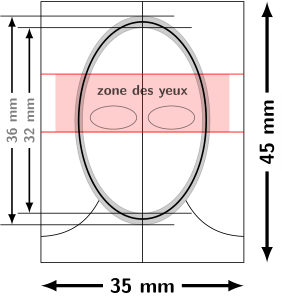

# format-photoid

Ce dépôt contient une calque pour des photos d'identité sous divers formats :
- PDF
- EPS
- PS
- PNG

en deux version :
- avec texte
- sans texte

L'image a été créée avec `tikz` sous `xelatex`.
